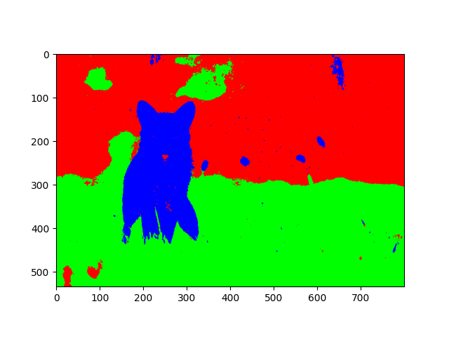

# Image Segmentation using Gaussian Mixture Model (GMM)

This project implements **Image Segmentation** using the **Gaussian Mixture Model** (GMM) with the **Expectation-Maximization (EM)** algorithm.  
It starts by using **K-Means clustering** to initialize the GMM parameters, then iteratively refines them for better segmentation.

## 📌 Project Structure
```
.
├── main.py                # Main script to run the segmentation
├── utils/
│   └── utils.py           # Helper functions (load_image, colors, etc.)
├── images/                # Input images for segmentation
├── requirements.txt       # Dependencies
└── README.md              # Project documentation
```

## 🛠 Requirements
Install the required packages before running the project:
```bash
pip install -r requirements.txt
```

## 🚀 How to Run
1. Place the image you want to segment in the `images/` folder.
2. Run the main script:
```bash
python main.py
```
3. Enter the image name **without extension** when prompted.
4. Enter the number of classes (segments) you want.
5. The segmented result will be displayed using `matplotlib`.

## 📷 Example
**Input image**  


**Segmented output**  


## 📖 How it Works
1. **Image Loading & Preprocessing**  
   - Reads the image and normalizes pixel values.
2. **Initialization with K-Means**  
   - Finds initial means, covariances, and priors.
3. **EM Algorithm for GMM**  
   - **E-Step:** Compute soft assignments (beliefs) for each pixel.
   - **M-Step:** Update parameters based on beliefs.
4. **Result Visualization**  
   - Assigns each pixel to the most probable class and maps it to a predefined color.

## 🧮 Algorithms Used
- **K-Means Clustering** (for initialization)
- **Gaussian Mixture Model** with **Expectation-Maximization**
- **Multivariate Gaussian Distribution**

